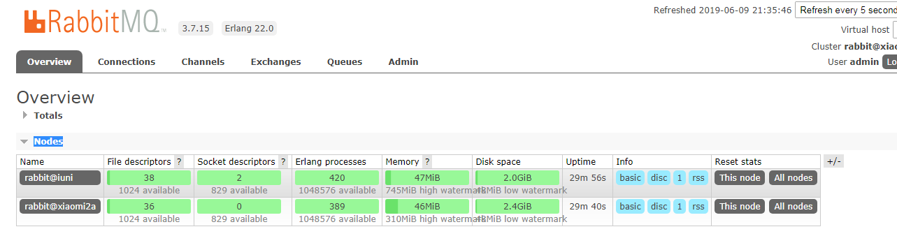

[toc]

# RabbitMQ 搭建集群

RabbitMQ 之所以会用 erlang 语言来编写，很重要的一个原因就是 erlang 语言天生分布式的特性。每个 erlang 虚拟机被称为一个节点，每个节点会有一个 erlang Cookie，相同值的 erlang Cookie 节点会自动组成一个集群。

rabbitmq集群中，各个rabbitmq为对等节点，即每个节点均提供给客户端连接，进行消息的接收和发送。节点分为内存节点和磁盘节点，一般的，均应建立为磁盘节点，为了防止机器重启后的消息消失；
RabbitMQ的Cluster集群模式一般分为两种，普通模式和镜像模式。镜像模式消息队列通过 rabbitmq HA 镜像队列进行消息队列实体复制。

## 搭建一个普通集群

普通模式下的继集群，每个节点会有相同的元数据（交换机，队列），但只有一个节点存储数据。假设现在存在一个集群存在 xiaomi2a 和 iuni 两个节点，有一个 test_echange 交换机,一个 text_queue 队列,绑定关系，一个 admin 用户；任意一个节点对这些元数据的操作，如删除队列，交换机，用户等，会对整个集群中所有的节点进行修改；但是队列中消息数据却只会存在其中一个节点，如果该节点的机器宕机了，那么将获取不到这个消息的数据，如果这个节点没有对数据进行持久化，这个消息就丢失了。

准备好两台服务器，我这里使用的是两台安卓手机，也可以使用两台虚拟机会更简单一些。假设两台机器的 ip 分别为 192.168.0.100(iuni) , 192.168.0.101(xiaomi2a)。两台服务器均已安装好 RabbitMQ （最好启动过一次），选择其中一台（这里选择xiaomi2a），使用命令查看 erlang Cookie 的值，并复制下来

```shell

# 修改 hosts 文件,在文件末尾的位置添加两行
# 192.168.0.100 iuni
# 192.168.0.101 xiaomi2a
vi /etc/hosts

# 我的系统是centos7,erlang版本 22.0 RabbitMQ 版本是 3.7.15
# 一般为当前用户根目录下 如果没有请尝试 /home/.erlang.cookie 或者 /var/lib/rabbitmq/.erlang.cookie
cat /root/.erlang.cookie 

# 先启动一台服务器的 RabbitMQ 服务
rabbit-server -detached
# 启动成功会显示 Warning: PID file not written; -detached was passed.

```

切换到另外一台服务器 iuni ，首先修改 erlang cookie 的值，由于这个文是只读的，需要先修改塔的文件权限，修改完值再改回去。

```shell
# 首先也是修改 hosts 文件,在文件末尾的位置添加两行
# 192.168.0.100 iuni
# 192.168.0.101 xiaomi2a
vi /etc/hosts

# 修改 erlang cookie 的文件属性
chmod 600 /root/.erlang.cookie

# 修改文件的值，使用上一台服务器的值
# 4-r 读, 2-r 写， 1-x 执行 0-什么都没有
vi /root/.erlang.cookie

# 改回只读权限，不然 erlang 认为两个文件不一致，
chmod 400 /root/.erlang.cookie

# 这个服务器需要先停止 rabbitMQ 服务
rabbitmqctl stop_app

# 然后让它加入上一台服务器组成集群,这里的 xiaomi2a 即为我们在 host 中配置域名 xiaomi2a, 
# 它对应着 192.168.0.101，同时它也是上台服务器的节点名 rabbit@xiaomi2a 这些最好保证一致
rabbitmqctl join_cluster rabbit@xiaomi2a
# 当显示 Clustering node rabbit@iuni with rabbit@xiaomi2a 表示成功
# 当显示 Error: unable to perform an operation on node 'rabbit@iuni'. Please see diagnostics information and suggestions below.需要重置一下 rabbitmqctl reset
# 如果是因为之前加入过其他的集群 rabbitmqctl forget_cluster_node rabbit@xiaomi2a 退出

# 启动当前服务器的 RabbitMQ ,当前节点的配置，数据会丢失，全部以第一个节点为主
rabbit-server -detached

```

随便选择一个节点访问 ip:15672 ，登录后查看 Overview/Nodes 下节点数量。




## 搭建镜像集群

应为普通集群的数据存在不可靠的问题，镜像模式就是为了解决这个问题的。镜像模式下，把需要的队列做成镜像队列，存在与多个节点属于 RabbitMQ 的 HA 方案。该模式解决了普通模式中的问题，其实质和普通模式不同之处在于，消息实体会主动在镜像节点间同步，而不是在客户端取数据时临时拉取。该模式带来的副作用也很明显，除了降低系统性能外，如果镜像队列数量过多，加之大量的消息进入，集群内部的网络带宽将会被这种同步通讯大大消耗掉。所以在对可靠性要求较高的场合中适用。RabbitMQ 的镜像模式依托于它的 [Policies](<https://www.rabbitmq.com/parameters.html#policies>) 模块，镜像模式集群也属于 RabbitMQ 的 [High availability（高可用）](<https://www.rabbitmq.com/pacemaker.html>) 方案。

镜像模式，根据其名字就是知道是在各个节点进行消息的镜像复制，依托于 [Policies](<https://www.rabbitmq.com/parameters.html#policies>) 模块我们可以实现指定某一个交换机和队列，或某一些交换机和队列的数据镜像存储。对于节点，也可以指定某几个节点或者全部节点来镜像存储。下面是 RabbitMQ 后台管理 [Policies](<https://www.rabbitmq.com/parameters.html#policies>) 的界面。


使用命令

```shell

# 添加一个名为 ha 匹配所有以test_ha开头的队列和交换机的镜像模式
rabbitmqctl set_policy ha 'test_ha^' '{"ha-mode":"all","ha-sync-mode":"automatic"}'
# 显示 Setting policy "ha" for pattern "test_ha^" to "{"ha-mode":"all","ha-sync-mode":"automatic"}" with priority "0" for vhost "/" ...

```

这样一个镜像的集群就搭建成功了，该集群内所有的以test_ha开头的队列和交换机对会被镜像的存在在两个RabbitMQ 中。后续我们再对参数进行详细的介绍。

* -p vhostpath 加上 -p 参数后，后面可以跟着指定的虚拟机
* name 定义一个当前 set_policy 的名称
* pattern 是匹配队列名称的正则表达式 , “^”代表所有，“^ha_”代表所有"ha"开头的
* priority 优先级。一个队列/交换机只会有一个生效的 Policy，如果匹配多个 Policy，则优先级数值最大的 Policy 生效
* definition JSON格式的一组键值对，表示设置的属性，会被注入匹配队列/交换机：
    * ha-mode：1.all 队列镜像在群集中的所有节点上。当新节点添加到群集时，队列将镜像到该节点2.exactly 集群中的队列实例数。3.nodes 队列镜像到节点名称中列出的节点。 
    * ha-sync-mode：镜像消息对于新加入节点的同步方式：automatic（自动），manually（手动）
    * federation-upstream-set：只有在  federation plugin 启用时有效.
* apply-to 该 Policy 是针对队列，还是交换机，还是同时针对两者


